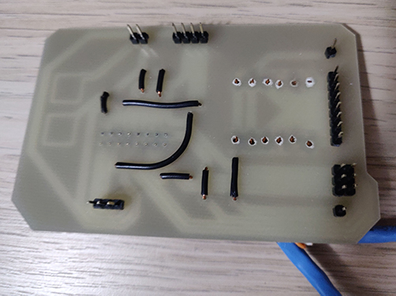

# 2-player-snake

Two-player snake game in C++ using Arduino Mega, 32x32 LED matrix, custom shield, and two custom 4-button controllers for Adv. Additive Manufacturing (UIC ENGR 294)

 

[Original GIF #1](https://media.giphy.com/media/iEMkRfB8JyjEhcMhLR/giphy.gif) | 
[Original GIF #2](https://media.giphy.com/media/J6tbl7obMBHApaVlm7/giphy.gif)

  

<!-- TOC -->

- [2-player-snake](#2-player-snake)
  - [D-pad Controller PCB](#d-pad-controller-pcb)
  - [Arduino Mega Shield](#arduino-mega-shield)
  - [Case](#case)
  - [Updated Case](#updated-case)

<!-- /TOC -->

(Few more pictures included in _Images/_)

## D-pad Controller PCB

Manually figuring out the routes for all 4 buttons.

 

Yes, I know the soldering is bad.

## Arduino Mega Shield

Also, manually routed the shield. Here is the mapping of the 16 pin connector socket for LED matrix and the routes to the Arduino Mega pinouts. The correct mapping might be the horizontal mirrored version; I didn't have a connector cable.

I only had access to single sided PCB so red PCB routes are on the top/main side and blue routes are on the back that had to be manually connected with wires.

  

## Case

Planning and designing the controller cases.

(Partially) Initial design. I forgot the divot where the soldering on the PCB takes up space. In the original case, you'll see I melted it. Screw holes are not in the CAD because I didn't have enough time to make sure they're were they should be and decided to just drill them.

  

Putting it all together.

 

## Updated Case

Added minor changes to the case design. Filet edges, screw holes, tighter tolerances, hole for ethernet cable, and printed with higher quality settings.

Old:

New:

  
 
